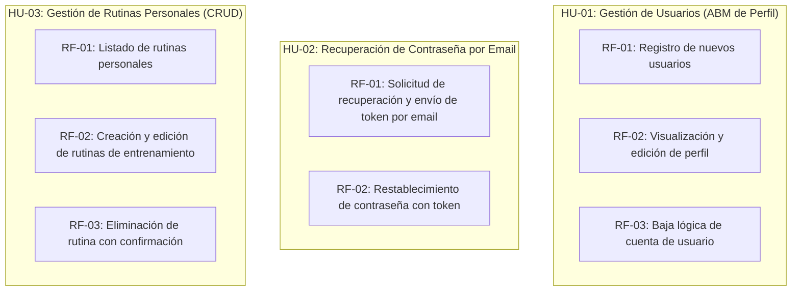

# Grafo de Dependencias -- FitArg

_Generado automaticamente el 2026-09-09T14:04:21.191Z -- no editar a mano, se sobreescribe en cada publicacion._

```mermaid
graph TD
  subgraph US_1788961186890["HU-01: Gestión de Usuarios (ABM de Perfil)"]
    REQ_1788962591125["RF-01: Registro de nuevos usuarios"]
    REQ_1788962599160["RF-02: Visualización y edición de perfil"]
    REQ_1788962657708["RF-03: Baja lógica de cuenta de usuario"]
  end
  subgraph US_1788961195716["HU-02: Recuperación de Contraseña por Email"]
    REQ_1788962657905["RF-01: Solicitud de recuperación y envío de token por email"]
    REQ_1788962658008["RF-02: Restablecimiento de contraseña con token"]
  end
  subgraph US_1788961200799["HU-03: Gestión de Rutinas Personales (CRUD)"]
    REQ_1788962658133["RF-01: Listado de rutinas personales"]
    REQ_1788962658244["RF-02: Creación y edición de rutinas de entrenamiento"]
    REQ_1788962658342["RF-03: Eliminación de rutina con confirmación"]
  end
```